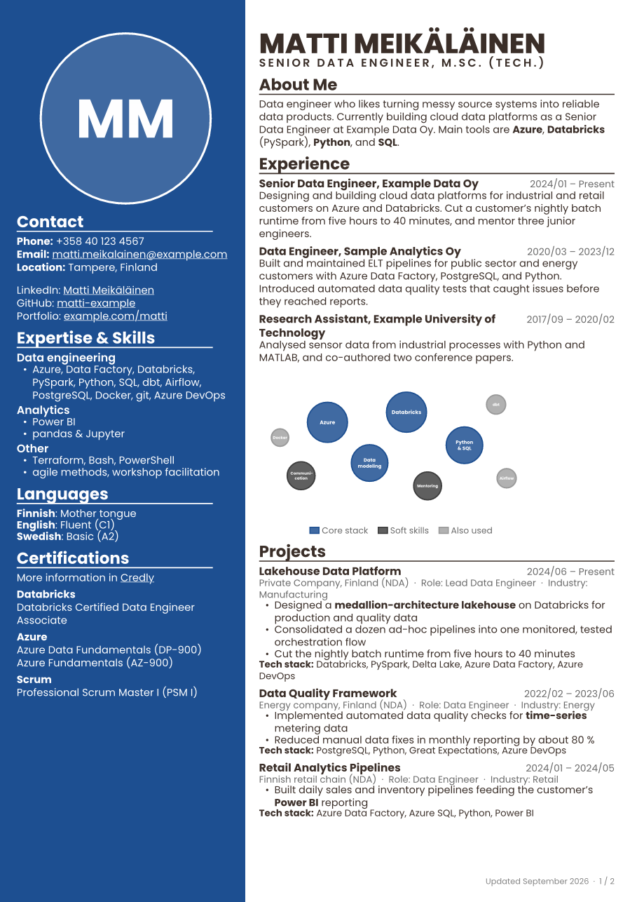
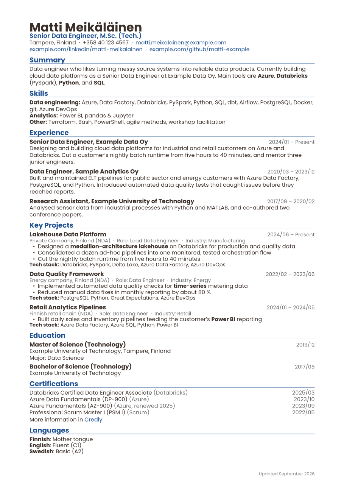
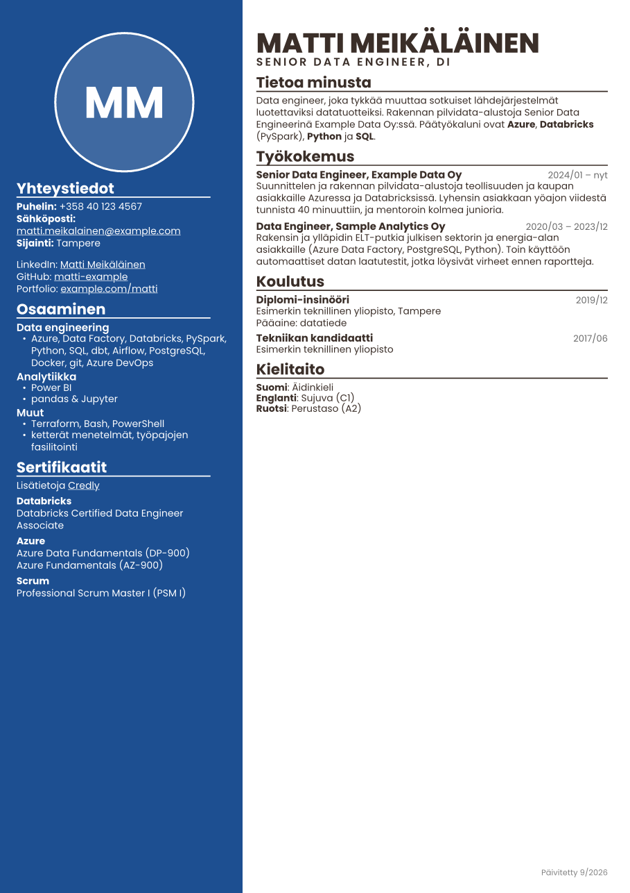
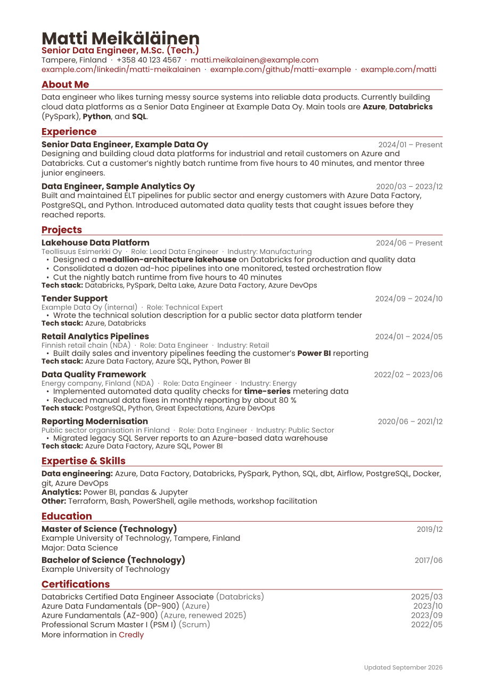

# single-source-cv

**One YAML file → your website CV page + several tailored PDF CVs, in several languages.**

Keep your whole CV in one place (`data/cv.yml`) and generate from it:

- **Website markdown** (`out/cv.md`) for GitHub Pages / Jekyll or any static site. Liquid tags pass through untouched.
- **PDF CVs** via [Typst](https://typst.app/), one per **profile** × **language**: a full CV, a one-page CV, a plain one-column **ATS-friendly** CV, a project-focused CV for tenders …
- An **internal** variant with real client names for company CV systems, while the public outputs say "Private Company (NDA)".

The same entry can say things differently per channel (emojis on the web, a tighter paragraph in the PDF), and profiles pick sections, order, filters, and style. The example data is a fictional *Matti Meikäläinen*.

| Full (sidebar) | ATS (one column) | One page (fi) | Internal |
|---|---|---|---|
|  |  |  |  |

> This is a template repository, published as-is. It is not actively maintained. Fork, copy, and change anything; issues and PRs are welcome but support is not promised.

## Quick start

Requires Python 3.10+. Typst comes from the `typst` pip package, so no separate install is needed.

```bash
python -m venv .venv
source .venv/bin/activate            # Windows PowerShell: .venv\Scripts\Activate.ps1  |  Git Bash: source .venv/Scripts/activate
pip install -r requirements.txt

python build.py md                   # -> out/cv.md (default language)
python build.py md --lang fi         # -> out/cv.md in Finnish
python build.py pdf --profile ats --lang en --png   # -> out/cv_ats_en.pdf + PNG previews
python build.py all --png            # markdown + every profile × language
python build.py list                 # profiles and what they are for
```

`--png` writes page previews `out/preview_*.png`. Look at them after every layout change (page count, overflow, sidebar spilling to the next page).

## Make it yours (after cloning)

Use **"Use this template"** on GitHub (a fresh repository without this history), or clone and re-initialise git. Then go through this list.

### 1. Privacy first

- If your data will contain anything internal (real client names, `internal: true` items), **make your repository private**. The whole point of `*_internal` fields is that they live next to the public text in the same file.
- Keep internal PDFs out of anything public. The included GitHub Action runs `build.py all --skip-internal` for this reason: workflow artifacts can be downloaded by anyone with read access.
- Your git history keeps everything you ever committed. If you later want to publish your own repo, start a new one rather than flipping a private repo with history to public.

### 2. Replace the data (`data/cv.yml`)

- Replace Matti with yourself. The comments at the top of the file and [AGENTS.md](AGENTS.md) explain the conventions: languages (`{en: ..., fi: ...}`), channel variants (`summary_web` / `summary_pdf`), channel-only items (`channels: [pdf]`), internal data (`client_internal`, `internal: true`), tags and dates.
- Keep the `id`s stable; profiles select items by `id` and `tags`.
- More data files: every `data/*.yml` is merged into one namespace (top-level keys must be unique), e.g. `data/publications.yml`.

### 3. Photo

- Put a square image in `assets/` and set `basics.photo: assets/photo.jpg`. Without a photo the PDF draws a circle with your initials.
- To show no photo at all, remove `photo` from the profile's `layout.sidebar` / `layout.main`.

### 4. Languages

- Supported languages are the top-level keys of `templates/labels.yml`. **The first one is the default** and the fallback for missing translations (the build prints a warning for each).
- To add e.g. Swedish, copy a block in `labels.yml`, rename it `sv:`, translate it, and use `{en: ..., sv: ...}` in the data. `build.py all` then also builds every profile in Swedish.
- To use only one language, delete the other block. Plain strings in the data work for every language.
- Date words come from the same file: `present`, and optionally `months` (web dates like "Feb 2026") and `months_long` (footer "Updated September 2026"). Without them dates are numeric.

### 5. Website template (`templates/cv.md.j2`)

- `templates/cv.md.j2` is a **generic starting point** that renders every section as plain markdown. Adapt it to your site: headings, order, front matter, badges, links. Every `templates/*.md.j2` renders to `out/<name>.md`, so you can have several pages.
- Jinja delimiters are changed to `<< var >>`, `<% block %>` and `<# comment #>` so that Jekyll's `{{ }}` / `` pass through as-is.
- The variables are the resolved data (`basics`, `experience` …) plus `labels` (UI strings of the language) and `lang`. Undefined variables are errors, so guard optional fields with `<% if x.field is defined %>`.
- Not using a website? Delete the template; `build.py md` then does nothing.

### 6. Skills bubble chart (optional, and honestly a bit fiddly)

- `skills.chart` draws the same bubble chart on the website (Chart.js) and in the PDF (Typst). It is a personal touch, not a necessity.
- **Bubbles are positioned by hand**: `x`, `y` on a 0–100 grid, `r` = radius in px of a 620 px wide chart. Nothing prevents overlaps, so expect a few rounds of edit → `--png` → look.
- Bubble sizes read as skill levels, so choose them deliberately, or leave the chart out: delete `skills.chart` and remove `skills_chart` from the profiles. The website template skips the chart when it is missing.
- `style.chart_scale` (e.g. `0.8`) shrinks it in a profile.

### 7. Profiles (`profiles/*.yml`)

- Included: `full` (sidebar, key projects, chart), `one-page`, `ats` (one column, conventional headings), `projects` (all public projects), `internal` (real client names; do not publish).
- A profile sets `layout` (`mode: sidebar | single`, section order), `filters` (`ids`, `include_tags`, `exclude_tags`, `max`), `labels` overrides (e.g. "Summary" instead of "About Me"), `style`, and optionally `publish_as` (see below). Add or delete profiles freely; `build.py all` builds whatever is there.
- `publish_as: resume.pdf` also writes the default-language PDF as `out/resume.pdf`, i.e. with the file name your website links to. Then publishing is always "copy the same files".

### 8. Look and feel

- Colours, font sizes, sidebar width etc. are `style` keys in the profile; the defaults and the full list are at the top of `templates/cv.typ`.
- The font is Poppins (in `fonts/`, SIL Open Font License). To change it, put the `.ttf` files in `fonts/` and set `style.font`.
- New PDF section: add `#let s-xxx(side) = ...` in `templates/cv.typ`, register it in the `sections` dictionary at the end, and add its heading to `labels.yml`.

### 9. Housekeeping

- Update `LICENSE` (copyright holder) if you redistribute your own version.
- `AGENTS.md` is written for AI coding agents (Claude Code, Codex …) and humans alike; keep it up to date when you change conventions, and the agent will follow them.

## Checking an ATS PDF

```bash
pip install pypdf
python -c "from pypdf import PdfReader; print('\n'.join(p.extract_text() for p in PdfReader('out/cv_ats_en.pdf').pages))"
```

The text should come out in reading order with whole words and recognisable section headings.

## License

Code: MIT (see `LICENSE`). Font: Poppins, SIL Open Font License 1.1 (see `fonts/OFL.txt`).
